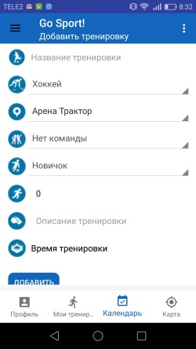

# Go Sport!

Программа для поиска подходящих тренировок для занятий спортом 
Часто мы хотим поиграть с кем-нибудь в футбол, хоккей, волейбол или другую командную игру,
но не знаем где, во сколько и какой уровень игры будет. Программный комплекс позволяет организаторам
игр публиковать информацию о своих мероприятиях, а игрокам в удобном интерфейсе смотреть карту и календарь игр.
Организаторы в свою очередь могут также контролировать количество игроков на тренировке. 
Доступен следующий функционал: 
- создание профиля пользователя из приложения 
- выбор видов спорта и желаемого уровня занятий 
- создания из приложения новых тренировок 
- загрузка с сервера мероприятий, отображение их на карте 
- запись на тренировку с последующей передачей информации на сервер 
  
Технические характеристики:
<ul>
<li> DB: Realm
<li> GPS: OSM droid
<li> API: Retrofit2
</ul>
  

